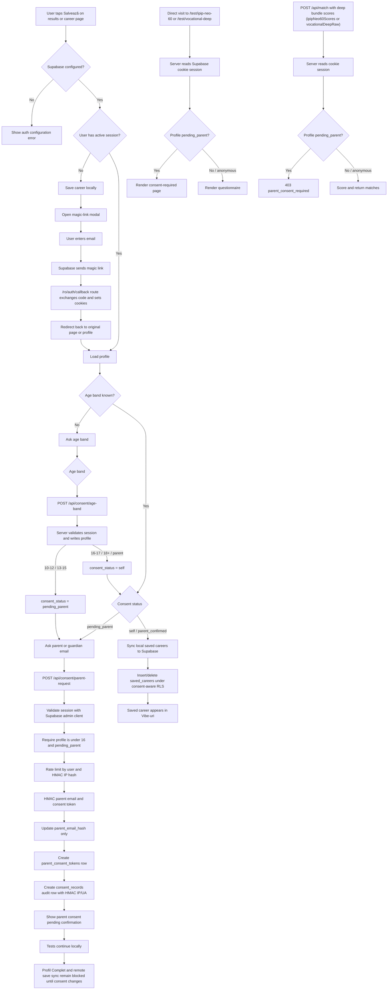

# Auth and Minor Consent Flow

This documents the Supabase auth + parent-consent slice for CeSaFiu.

Scope in this version:

- `Salvează` is the first auth gate.
- Magic-link auth creates/loads the user session through a cookie-backed Supabase callback.
- The app asks for an age band after auth.
- Users aged `10-12` or `13-15` enter `pending_parent`.
- Age-band and consent-state writes are server-side only.
- Parent email is HMAC-hashed and a hashed consent request token is recorded.
- `saved_careers` inserts are consent-aware in RLS.
- **Profil Complet** (IPIP-NEO-60 + Vocațional Complet + PDF report) is free during the pilot, but structured as a future paid bundle. It is server-gated for `pending_parent` users at both the page level (`/test/[slug]` for any slug in `PAID_TEST_SLUGS`) and the API level (`/api/match` when the body carries any `PAID_MATCH_FIELDS`).
- See [PAID-BUNDLE-POSITIONING.md](./PAID-BUNDLE-POSITIONING.md) for the bundle product decision and copy.
- Actual parent email delivery and confirmation are not wired yet.

## Flowchart

## Data Model

`profiles`

- One row per Supabase auth user.
- Stores `age_band`, `consent_status`, optional display name, and a hashed parent email for minor consent.
- Authenticated users can read only their own row.
- Client insert/update grants are revoked; profile consent fields are written through server API routes.

`saved_careers`

- Stores `(user_id, career_id)`.
- Protected by RLS so authenticated users can select and delete only their own saved careers.
- Inserts additionally require the user's profile to have `consent_status in ('self', 'parent_confirmed')`.
- Does not foreign-key `career_id` yet because careers are still file-backed in the app.

`parent_consent_tokens`

- Stores HMAC hashes of generated parent-consent tokens for future email confirmation.
- RLS is enabled with no browser policies; only server-side privileged access should use it.

`consent_records`

- Audit table for consent-related events.
- Current event: `parent_consent_requested`.
- Stores HMAC hashes of request IP and user agent for abuse investigation without retaining raw values.
- Authenticated users can only read their own consent records.

## Current Limitations

- Parent email delivery is not implemented yet.
- Parent confirmation route is not implemented yet.
- Session replay masking still needs verification in a real Umami recording.
- The secret key must be configured only as an environment variable.
- `CONSENT_HASH_PEPPER` must be configured as a server-only environment variable.
- The secret key that was shared during implementation should be rotated before production.
