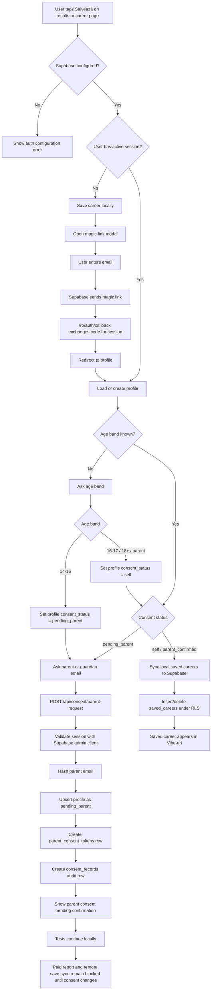

# Auth and Minor Consent Flow

This documents the first Supabase auth slice for CeSaFiu.

Scope in this version:

- `Salvează` is the first auth gate.
- Magic-link auth creates/loads the user session.
- The app asks for an age band after auth.
- Users aged `14-15` enter `pending_parent`.
- Parent email is hashed and a consent request token is recorded.
- Actual parent email delivery and confirmation are not wired yet.

## Flowchart

## Data Model

`profiles`

- One row per Supabase auth user.
- Stores `age_band`, `consent_status`, optional display name, and a hashed parent email for minor consent.
- Protected by RLS so authenticated users can select, insert, and update only their own row.

`saved_careers`

- Stores `(user_id, career_id)`.
- Protected by RLS so authenticated users can select, insert, and delete only their own saved careers.
- Does not foreign-key `career_id` yet because careers are still file-backed in the app.

`parent_consent_tokens`

- Stores generated parent-consent tokens for future email confirmation.
- RLS is enabled with no browser policies; only server-side privileged access should use it.

`consent_records`

- Audit table for consent-related events.
- Current event: `parent_consent_requested`.
- Authenticated users can only read their own consent records.

## Current Limitations

- Parent email delivery is not implemented yet.
- Parent confirmation route is not implemented yet.
- The secret key must be configured only as an environment variable.
- The secret key that was shared during implementation should be rotated before production.
